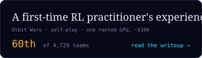

# Abhyuday Roychowdhury

Chief inventor of slightly useful tech. Some of it turned out very useful.
Co-founder and CTO of [Bluevia Health](https://www.blueviahealth.com), where our AI calls patients before surgery. Before that Yelp and Twitter.

**[Read the story → abhyuday.uk](https://abhyuday.uk)**

In my spare time I teach small brains to play games. Two writeups:

 

[abhyuday.uk](https://abhyuday.uk) · [Kaggle](https://www.kaggle.com/abhyuday10) · [LinkedIn](https://www.linkedin.com/in/abhyuday-roychowdhury/) · [X](https://x.com/abhyuday_roy)
